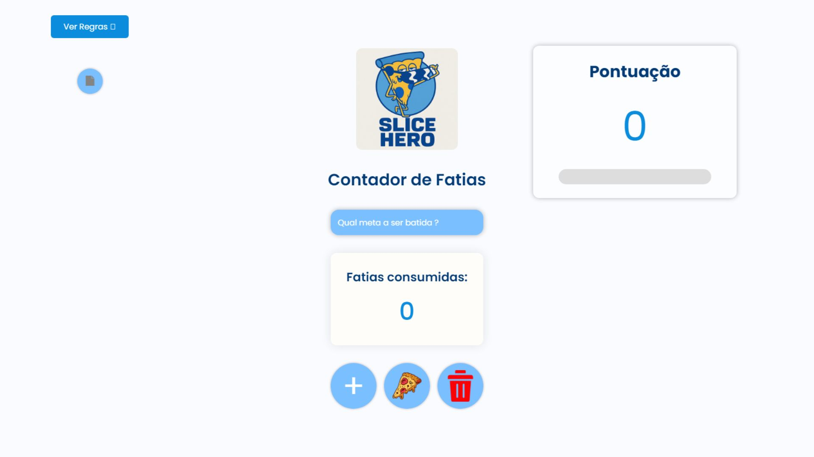

# 🍕 Contador de Pizza

Um projeto divertido e interativo feito com **HTML**, **CSS** e **JavaScript**, que permite registrar quantas fatias de pizza foram consumidas, definir uma meta, ver a pontuação baseada nas fatias e salvar os dados localmente no navegador. Feito para uma competição entre colegas da faculdade que ao final de cada semestre concluído era comemorado em um rodízio de pizza.

---

## 📸 Prévia do Projeto



---

## 🚀 Funcionalidades

- ✅ Adicionar fatias com um clique.
- ✅ Definir uma meta e acompanhar o progresso visualmente.
- ✅ Pontuação automática: a cada 3 fatias = 1 ponto.
- ✅ Feedback com sons de mordida e vitória.
- ✅ Modal de meta batida com gif animado.
- ✅ Regras visuais com botão de ajuda.
- ✅ Dados salvos no `localStorage`: continuam após fechar o navegador.
- ✅ Compatível com desktops e dispositivos móveis.

---

## 🧠 Como Funciona

### 🎯 Meta
- Você define um número de fatias como objetivo.
- Quando esse número é atingido, uma animação e som de vitória são exibidos.

### 🍕 Fatias
- Clique no botão "+" para somar uma fatia.
- Cada clique também atualiza a barra de progresso.

### 🏆 Pontuação
- A cada 3 fatias, você ganha 1 ponto automaticamente.
- Os pontos são exibidos no placar lateral com um troféu 🏆.

---

## 🗂️ Estrutura do Projeto

```
contador-pizza/
│
├── index.html               # Página principal
├── README.md                # Este arquivo
│
├── src/
│   ├── css/
│   │   └── style.css        # Estilo principal do projeto
│   ├── js/
│   │   ├── js.js            # Lógica do contador e animações
│   │   └── pontos.js        # Lógica da pontuação
│   ├── img/
│   │   ├── logo.png         # Logo do projeto
│   │   ├── pizza.webp       # Ícone do botão pizza
│   │   ├── deletar.png      # Ícone do botão deletar
│   │   ├── stevegif.gif     # Gif da vitória
│   │   └── vitoria.gif      # Confetes ou gif de comemoração
│   └── sound/
│       ├── cartoon_bite_sound_effect.mp3 # Som da mordida
│       └── you-win-sequence-1-183948.mp3 # Som de vitória
```

---

## 💾 Armazenamento

Este projeto utiliza o `localStorage` do navegador para armazenar:

- Contador de fatias
- Pontuação
- Meta
- Progresso da barra

Os dados permanecem salvos mesmo ao fechar e reabrir o navegador.

---

## 🧩 Tecnologias Utilizadas

- HTML5
- CSS3 (com responsividade e variáveis)
- JavaScript (DOM, localStorage, áudio)
- Google Fonts (Poppins)
- Material Symbols (ícones via Google Fonts)

---

## 📱 Responsividade

O projeto foi pensado para se adaptar a telas grandes e pequenas:

- 💻 Desktop 100%
- 📱 Celulares verticais e horizontais
- 📟 Tablets

Inclui media queries para ajustar tamanhos e esconder elementos que não cabem (como o botão de impressão).

---

## 🔊 Áudio

- **Mordida**: ao registrar uma fatia.
- **Vitória**: ao bater a meta.
- ⚠️ O áudio de vitória só será reproduzido automaticamente se o usuário interagir com a página (por política dos navegadores).

---

## 🖨️ Impressão

- Botão `📄` no topo esquerdo abre o modo de impressão (somente para pc).

---

## 🛠️ Como Usar

1. Baixe ou clone este repositório:
   ```bash
   git clone https://github.com/seu-usuario/contador-pizza.git
   ```

2. Abra o `index.html` no navegador.

3. Divirta-se registrando fatias de pizza consumidas! 🍕

ou acesse https://htmlpreview.github.io/?https://github.com/carloshenriquepereiracardoso14/contador-pizza/blob/master/index.html

---

## 👨‍💻 Autor

**Carlos Henrique**  
Feito com 💛 e fome de pizza.  
📧 [carloscardosoesse@gmail.com](mailto:carloscardosoesse@gmail.com)
🔗 [https://www.linkedin.com/in/carlos-henrique-835659232/]

---

## 📝 Licença

Este projeto está sob a licença MIT.  
Sinta-se livre para usar, modificar e compartilhar!
